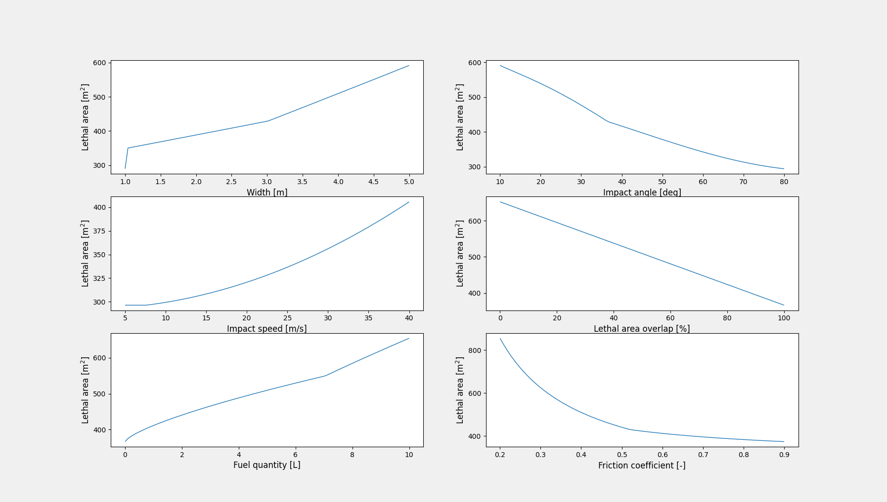

===========================
Example 2: Model comparison
===========================

This example shows the basics of using the different models in CasEx.
It shows how to set up the necessary parameters and variables, and how
to call the `critical_area_model` function to calculate critical areas for the
models. It also shows how to modify an existing setup to change from one aircraft
to another.

As in example 1, we start by setting up a few standard parameters, and
instantiate classes for friction coefficient and critical area.

.. literalinclude:: ../../../examples/example2_model_comparison.py
    :lines: 18-24

We choose a fixed wing aircraft (although at this stage of development, CasEx
does not use this information) with a width of 4 meters and length of 3.2 meters.
The mass is 25 kg, and the friction coefficient is aluminum against concrete.

.. literalinclude:: ../../../examples/example2_model_comparison.py
    :lines: 27-32

We then instantiate the class for the aircraft, and set fuel type and quantity,
friction coefficient, and coefficient of restitution.

.. literalinclude:: ../../../examples/example2_model_comparison.py
    :lines: 35-39

The impact speed is chosen such as to be equivalent to a kinetic energy of
34 kJ.

.. literalinclude:: ../../../examples/example2_model_comparison.py
    :lines: 43
    
The impact angle is chose to be 25 degrees.

.. literalinclude:: ../../../examples/example2_model_comparison.py
    :lines: 46

The overlap betweeb inert and deflagration critical areas is set at 50%.

.. literalinclude:: ../../../examples/example2_model_comparison.py
    :lines: 49

We want to compare models, and we add the result from the same computation for
each model to a list `p`.

.. literalinclude:: ../../../examples/example2_model_comparison.py
    :lines: 52-56
    
We do the computation one more time, except we change the impact angle to 65 degrees.

.. literalinclude:: ../../../examples/example2_model_comparison.py
    :lines: 59-61

We then redo the computations with a different size aircraft, again with an impact
angle of 25 degrees.

.. literalinclude:: ../../../examples/example2_model_comparison.py
    :lines: 64-72

And finally, we redo the computations are 65 degree impact angle.

.. literalinclude:: ../../../examples/example2_model_comparison.py
    :lines: 75-77

Note that `p` now is a 2 dimensional list, with different computations
along the first axis and the five different outputs from the critical area
model along the second dimension. Since in this example we are only interested in
the total critical area, all use of `p` is on the form `p[x][0]`.

The result of the computations are shown in the figure below.

There is a noticable difference between the models. Please see Appendix B in
Annex F :cite:`JARUS_AnexF` for more details
on the varoius models.
