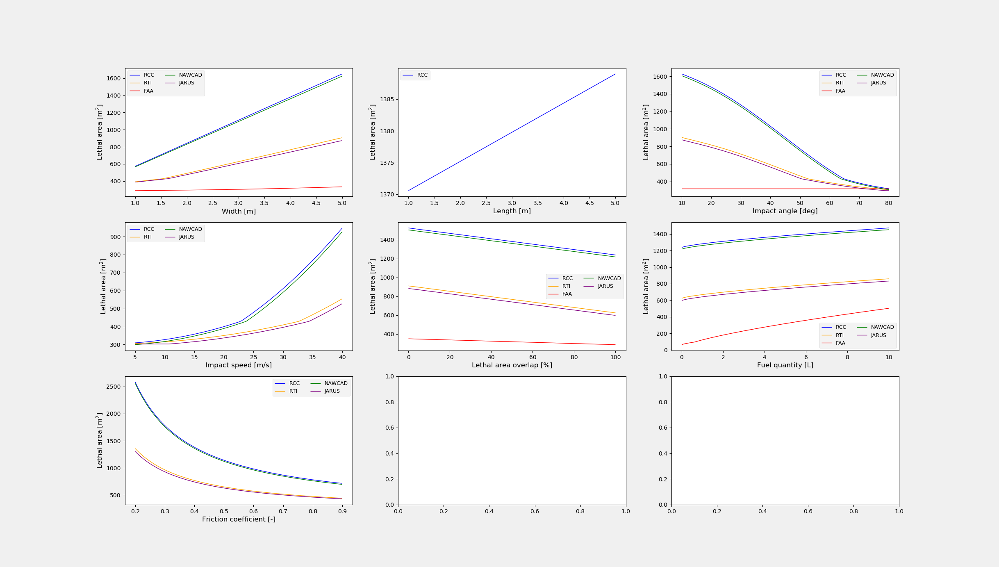

=======================
Example 2: Vector input
=======================

NOT YET UPDATED TO SORA 2.5

This example shows how to use the models with a vector input to generate a vector output.
Using this feature it is possible to generate graphs for variations on
one input parameter without resorting to a loop.

This example shows this for the following parameters:

    * width
    * length
    * impact angle
    * impact speed
    * lethal area overlap
    * fuel quantity
    * friction coefficient

Note that not all models include all of the above parameters. If a model does not include
a specific parameters, it does not produce a vector output, even if a vector input is given
for that parameter.

We begin with the usual setup, which was also done in example 2.

.. literalinclude:: ../../../casex/examples/example3_vector_input.py
    :lines: 26-46

We start with impact speed and angle as this:

.. literalinclude:: ../../../casex/examples/example3_vector_input.py
    :lines: 49-50

We setup a figure to show the output of the models for vector inputs.

.. literalinclude:: ../../../casex/examples/example3_vector_input.py
    :lines: 56-57

As in example 2, we use `p` for capturing the output of all the diffirent
computations.

.. literalinclude:: ../../../casex/examples/example3_vector_input.py
    :lines: 60

First, we set the width to an array instead of a scalar. Here we choose the width
to vary from 1 to 5 meters over 100 steps.

.. literalinclude:: ../../../casex/examples/example3_vector_input.py
    :lines: 63-64

And then we simply call the `critical_area` method like before (for all five models).
It is important to
note that since one of the parameters in the computation is now an array rather
than a scalar, the output is also an array with the same size as the "input".

.. literalinclude:: ../../../casex/examples/example3_vector_input.py
    :lines: 65-66

Since only one parameters at a time can be a vector input, we reset the width to
a scalar value. And now we set the length to an array.

.. literalinclude:: ../../../casex/examples/example3_vector_input.py
    :lines: 69-73

We reset the length and set the impact angle to an array.

.. literalinclude:: ../../../examples/example3_vector_input.py
    :lines: 76-79

Since the impact angle is not set through the aircraft class, but directly
as an input to `critical_area`, we do not need to reset the impact angle. We
simply use the original variable `impact_angle`. And we set the impact speed
to be an array.

.. literalinclude:: ../../../casex/examples/example3_vector_input.py
    :lines: 82-84
    
We do the same with the critical area overlap.

.. literalinclude:: ../../../casex/examples/example3_vector_input.py
    :lines: 87-90
    
The fuel quantity is set as an array.

.. literalinclude:: ../../../casex/examples/example3_vector_input.py
    :lines: 92-95

And finally, we also set the friction coefficient as an array.

.. literalinclude:: ../../../casex/examples/example3_vector_input.py
    :lines: 98-102

We then plot all the outputs. Note that this plotting is a bit selective, since
not all models produce a vector output, simply because some of the parameters are
not used in some of the models. For instance, the length is only used in the RCC
model.

