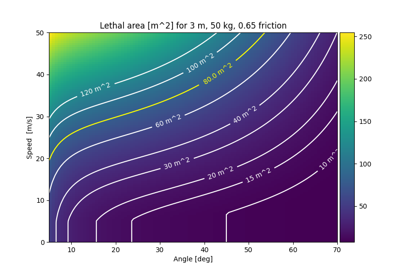

===========================================
Example 5: Isoparametric critical area plot
===========================================

This example makes a colored plot of the lethal area for varying impact angles and
impact speeds. The size of the aircraft as well as the other parameters are fixed.
The idea is to visualize the relation between
angle and speed, since this is one of the challenges in understanding the
transition from the JARUS model to the iGRC table.

The target for this example is the second column in the iGRC table, where the defined lethal area
is 80 m^2. Therefore, the isoparametric curve for 80 m^2 is shown in yellow
along with other iso curves in white for comparison.

We start by setting up the critical area class.

.. literalinclude:: ../../../casex/examples/example5_iso_CA_plot.py
    :lines: 19

We instantiate the :class:`AnnexFParms` class, since we want to use the parameters
for the smallest size aircraft in the iGRC table, and we can find them in that class.

.. literalinclude:: ../../../casex/examples/example5_iso_CA_plot.py
    :lines: 22

We then setup the aircraft based on the parmaters for the first column
in the iGRC table (thus the index `[0]` on `AFP.CA_Parms`). Note that this is not specific
for fixed-wing, since this information is not currently being used by
the critical area computation.

.. literalinclude:: ../../../casex/examples/example5_iso_CA_plot.py
    :lines: 25-26

We do not use any fuel.

.. literalinclude:: ../../../casex/examples/example5_iso_CA_plot.py
    :lines: 27-28

And we use the friction coefficient from Annex F.

.. literalinclude:: ../../../casex/examples/example5_iso_CA_plot.py
    :lines: 29

We want to plot over the full range of impact speed and impact angles. However,
since very shallow impact angles are not handled well by the model, we start at
5 degrees. For speed, we cap it at 40 m/s. Each axis will be 100 steps, which is
fine for a relatively smooth plot.

.. literalinclude:: ../../../casex/examples/example5_iso_CA_plot.py
    :lines: 31-33

We then compute the critical area for all combinations of speed and angle. Note that we
could have replaced one of the loops with an array input, but since we cannot replace both
(since the `critical_area` method does not support 2D array input), we have chosen to run both
dimensions as loops for code clarity.

.. literalinclude:: ../../../casex/examples/example5_iso_CA_plot.py
    :lines: 35-38

The plot is setup with room for a colorbar on the right.

.. literalinclude:: ../../../casex/examples/example5_iso_CA_plot.py
    :lines: 40-43

The matrix is added to the plot.

.. literalinclude:: ../../../casex/examples/example5_iso_CA_plot.py
    :lines: 45-46

Conturs are added to the plot.

.. literalinclude:: ../../../casex/examples/example5_iso_CA_plot.py
    :lines: 48-49

A yellow contour is added for the target critical area for the first column
in the iGRC table.

.. literalinclude:: ../../../casex/examples/example5_iso_CA_plot.py
    :lines: 51-52

And the colorbar is added along with axes labels and title.

.. literalinclude:: ../../../casex/examples/example5_iso_CA_plot.py
    :lines: 54-59

The contours in the output image show where there is a constant critical area for varying
combinations of speed and angle. 

There is a significant "drop" visible for the
lower speeds. This is coming from lethal kinetic energy limit described
in Annex F, i.e., the disregard of the slide part of the critical area where the slide speed
is small enough to have a kinetic energy less than the lethal limit. When the kinetic energy at the start
of the slide is less than the lethal kinetic energy, only the glide part is lethal,
and this does not depend on speed, only on impact angle. This results in the CA remaining constant
for changing speeds for sufficiently low speeds. Consequently, the iso curve becomes vertical in this area.
