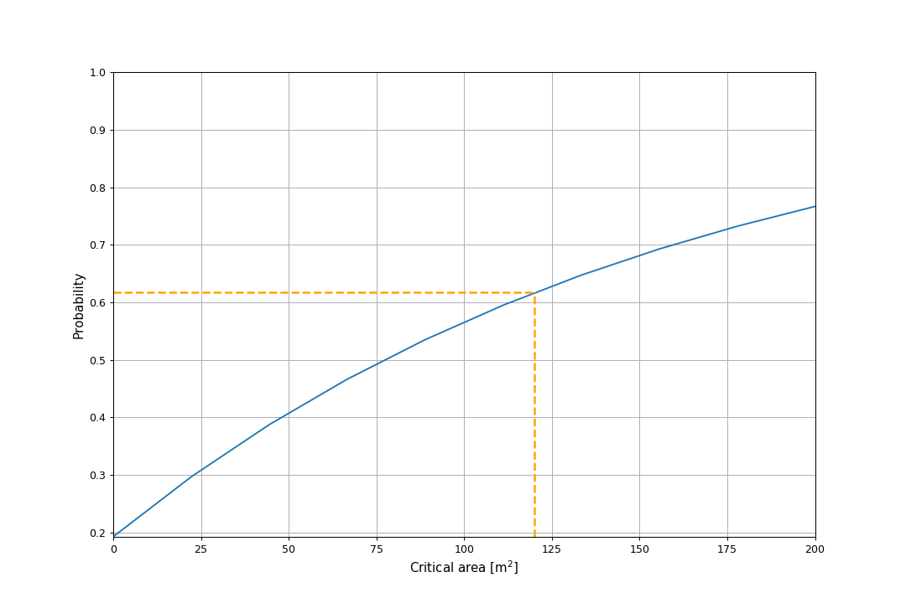

====================
Example 6: Obstacles
====================

*General text explaining what the example shows*

.. literalinclude:: ../../../examples/example6_obstacles.py
    :lines: 6-76

*Text explaining the console output*

.. code-block:: console

    Probability of reduction to at most 120 m^2 is 62%

*Text explaining the image output*

