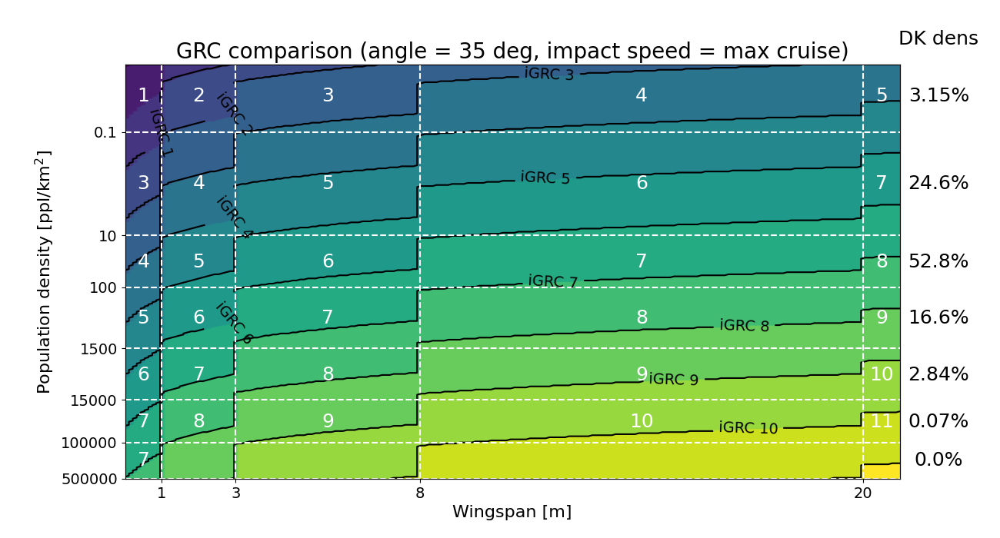

=========================================
Example 7: JARUS model vs the iGRC values
=========================================

In this example we compare the iGRC table in Annex F with the actual output of the JARUS model. This is done by plotting
the critical area for a variety of wingspan and population densities. This is similar to the iGRC figures that can be
computed with the :class:`Figures` class, which do the same thing, but for the simplified model.

We start with setting standard person parameters.

.. literalinclude:: ../../../casex/examples/example7_JARUS_model_vs_iGRC.py
    :lines: 14-15
    
and then we need to decide the impact angle. This is not used in the
simplified model, where the impact angle has been simplified away. However,
for the JARUS model we need to set this, since the critical area depends on it.
Here we choose 35 degrees since this angle has a specific
meaning in Annex F. But any angle will do, but obviously produce a slightly
different plot.

.. literalinclude:: ../../../casex/examples/example7_JARUS_model_vs_iGRC.py
    :lines: 16
    
We instantiate the CA model class.    

.. literalinclude:: ../../../casex/examples/example7_JARUS_model_vs_iGRC.py
    :lines: 20
    
We set the sampling density for the two axes.

.. literalinclude:: ../../../casex/examples/example7_JARUS_model_vs_iGRC.py
    :lines: 23-24
    
We set the arrays for the sampling on the two axes. Note that the wingspan
axis is linear, while the population density axis is logarithmic.

.. literalinclude:: ../../../casex/examples/example7_JARUS_model_vs_iGRC.py
    :lines: 27-28
    
We instantiate the Annex F parmeters class :class:`AnnexFParms`.

.. literalinclude:: ../../../casex/examples/example7_JARUS_model_vs_iGRC.py
    :lines: 31
    
Initialize the background matrix with zeros.

.. literalinclude:: ../../../casex/examples/example7_JARUS_model_vs_iGRC.py
    :lines: 34

We run a for loop over the range of the wingspan.

.. literalinclude:: ../../../casex/examples/example7_JARUS_model_vs_iGRC.py
    :lines: 37

Now, for every value of the wingspan, we want to use the aircraft values
associated with the wingspan, i.e. the appropriate column in the iGRC table.

.. literalinclude:: ../../../casex/examples/example7_JARUS_model_vs_iGRC.py
    :lines: 40-49

Since we previously set the impact angle to 35 degrees, we will use the cruise speed
as impact speed. 

.. literalinclude:: ../../../casex/examples/example7_JARUS_model_vs_iGRC.py
    :lines: 52

However, if we had chosen another angle, we would consider using another speed.
Specificallty, in Annex F it is assumed that for an impact at 9 degrees, the speed is reduced
equivalent to multiplying with a factor 0.7. This glide speed value can also be obtained from the
AFP class as `AFP.CA_parms[column].glide_speed`.

We also set the wingspan according to the maximum value from each class.

.. literalinclude:: ../../../casex/examples/example7_JARUS_model_vs_iGRC.py
    :lines: 55

We then compute the size of the critical area using the standard values
from Annex F (including the assumptions on the kinetic energy, which we
get by setting a -1 as the last input). Since there is no deflagration, the
overlap is set to zero.

.. literalinclude:: ../../../casex/examples/example7_JARUS_model_vs_iGRC.py
    :lines: 58-59
    
Finally, we populate the background matrix for the plot, that is the iGRC values
associated with the combination of population density and critical area.

.. literalinclude:: ../../../casex/examples/example7_JARUS_model_vs_iGRC.py
    :lines: 62-63
    
Note that the `[0]` at the end selects the raw iGRC value, while a `[1]` would select
the rounded up iGRC value.
    
This is followed by numerous lines for creating the plot. This includes showing
the matrix along with contours, setting the tick locations and labels,
and white lines and text for overlaying the iGRC. The result is as follows.

The iso-parametric curves in black show where the iGRC value has exactly integer values in the background
plot. So for instance the curve for iGRC 9 is the boundary between values below 9 and above 9.

The percent of area in Denmark which corresponds to the different population density
bands is also shown. These values are based on locations of addresses and a grid size of 1 km by 1 km.
This information does not come from CasEx, and is just
hardcoded into this example.