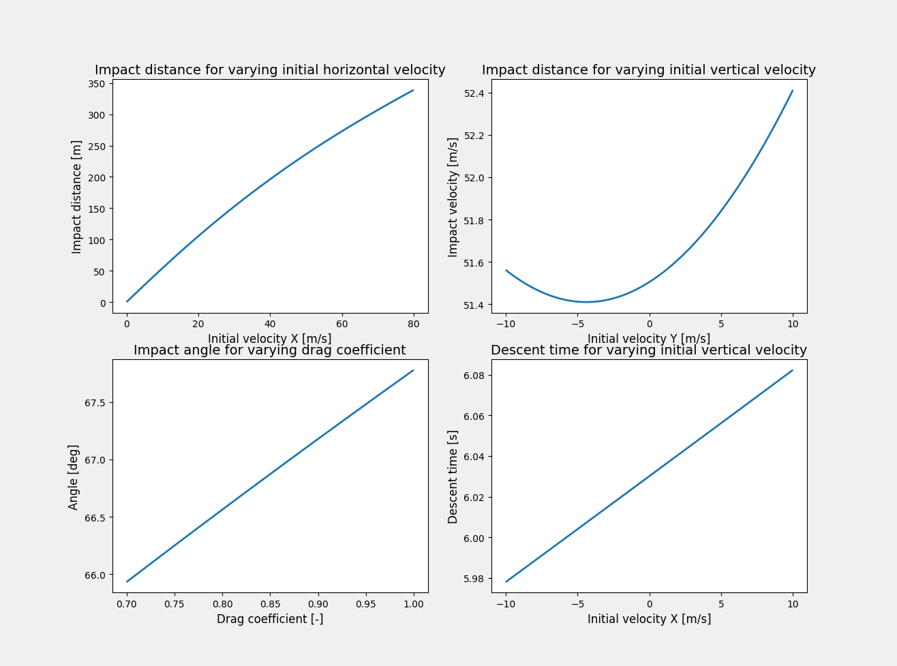

==================
Example 8: Figures
==================

This example reproduces the figures in Annex F :cite:`JARUS_AnnexF`.

The various figures can be separately generated by calling the functions
with the appropriate boolean settings as shown
in this example. However, other variations of the figures can also be generated.
The documentation for each figure is
provided in :class:`figures`.

The first method generates Figure 6, which shows the relation between
angle and speed for a constant critical area. It is based on example 4,
but include all five classes. In Annex F only the subplot for the 3 m
class is shown.

.. literalinclude:: ../../../examples/example6_obstacles.py
    :lines: 14

.. code-block:: console

    Probability of reduction to at most 120 m^2 is 62%
