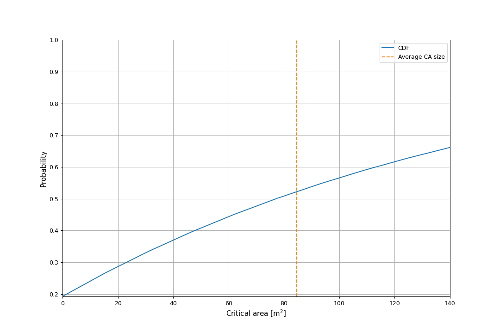

====================
Example 8: Obstacles
====================

The use of obstacles for reducing the critical area is demonstrated in this example.
The nominal critical area for the 3 m category is 140 :math:`\mathrm{m}^2`,
and we want to see how much the critical
area is reduced for an obstacle density of 800 houses per :math:`\mathrm{km}^2``.

The critical area of 140 :math:`\mathrm{m}^2` is associated with the second column in the
iGRC, which is for the 3 m wing span. Therefore, we set the width of the CA to 3.

.. literalinclude:: ../../../casex/examples/example8_obstacles.py
    :lines: 14

Consequently, the length of the CA must be 140 divided by the width.

.. literalinclude:: ../../../casex/examples/example8_obstacles.py
    :lines: 17

We set the density to 800 houses per :math:`\mathrm{km}^2`, and convert to
a density measure in obstacles per square meter.

.. literalinclude:: ../../../casex/examples/example8_obstacles.py
    :lines: 20-21

The size of the houses follows a 2D normal distribution for width and length.
We set the mean values and standard deviations for width

.. literalinclude:: ../../../casex/examples/example8_obstacles.py
    :lines: 24-25

and for length

.. literalinclude:: ../../../casex/examples/example8_obstacles.py
    :lines: 28-29

We instantiate the :class:`Obstacles` class. The third input argument
is only used for simulation, which we don't do here. So it is just
set to zero.

.. literalinclude:: ../../../casex/examples/example6_obstacles.py
    :lines: 32

We want to compute the probability for varying length of the critical area,
so we generate an array from 0 to the length of the nominal CA.
Since the resulting curve is quite smooth, it is not necessary to use
all that many points. We have chosen 10 here, which is usually sufficient.

.. literalinclude:: ../../../casex/examples/example8_obstacles.py
    :lines: 38-39

The computations of the cumulatative density function there are three integrals that
have to be evaluated. We must specify at what resolution this happens.
A value of 25 is typically sufficient. Increasing it will not produce notiable
different results.

.. literalinclude:: ../../../casex/examples/example8_obstacles.py
    :lines: 43

We now compute the CDF curve.

.. literalinclude:: ../../../casex/examples/example8_obstacles.py
    :lines: 46-47

The resulting curve is plotted.

The blue curve shows the probability of the CA being reduced to a
given value or less. The curve noticable does not go to 100%, which may seem odd, since
obviously the probability of the CA being less then 140 is 100%. This is because the graph in
reality should go vertically up from the current ending point around 76% to 100%, but this jump is
not implemented in the code. This is caused by the fact that a certain percentage of the crashes do not
impact an obstacles, and thus stays at nominal CA size. This percentage in this case would be around 24%.

